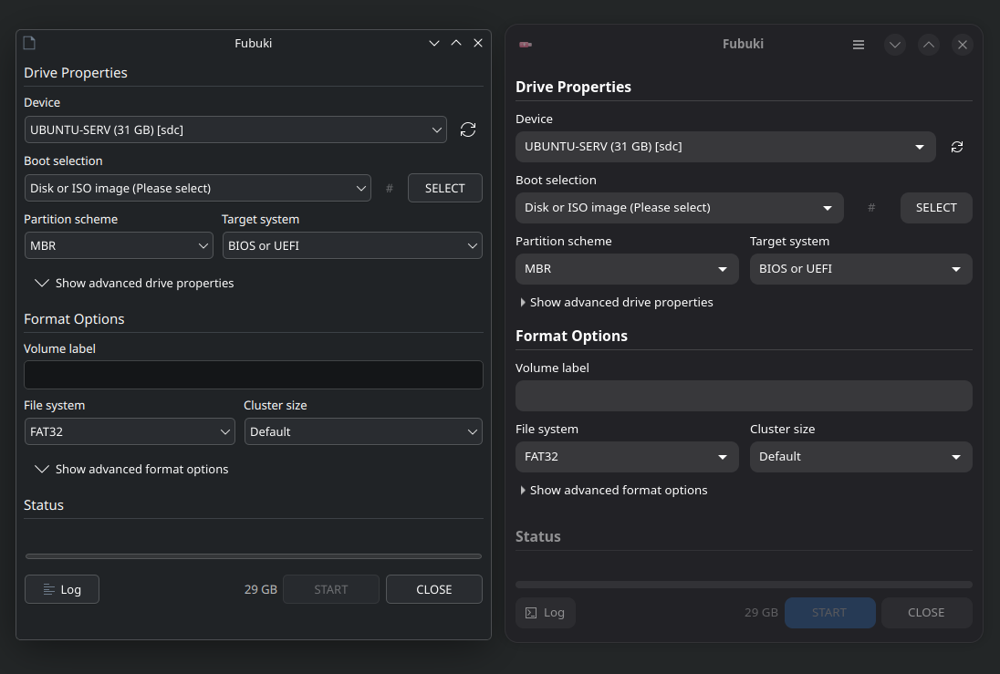

# Stoke

**A bootable USB writer for Linux, in the spirit of Rufus.**

Stoke makes a USB stick that boots, from Windows and Linux installers, live
systems, DOS, and raw disk images. It does the things Rufus does that a plain
`dd` cannot, and it does them with the tools a Linux system already has.

- **Windows install media** on NTFS or exFAT, booting on UEFI through
  UEFI:NTFS, or on FAT32 with `install.wim` split for you.
- **Windows 11 without the checks**: TPM, Secure Boot and RAM requirements
  removed inside `boot.wim`, the 24H2 in-place-upgrade wrapper, and answer
  files for a local account, no Microsoft account, no telemetry, no BitLocker.
  Optionally a fully unattended install.
- **Windows To Go** on MBR or GPT, and **Windows XP** setup media.
- **Linux ISOs** copied as files with the fixes they need on a stick, GRUB or
  Syslinux installed for BIOS boot, a persistent partition for Ubuntu and
  Debian live media. Or DD mode for hybrid images, with read-back verification.
- **FreeDOS**, KolibriOS, Grub4DOS, and plain UEFI:NTFS drives.
- Compressed images (gzip, xz, bzip2, zstd), fixed VHD, checksums, a
  destructive bad-blocks scan.
- A KDE window (`stoke-qt`) and a GNOME window (`stoke-gtk`) over one
  engine with a command line (`stoke`). Twelve languages.

## Install

Arch Linux and derivatives, from the AUR:

    yay -S stoke stoke-qt      # KDE (was fubuki-qt)
    yay -S stoke stoke-gtk     # GNOME

Or from this tree: `makepkg -si` in `stoke/`, then in `stoke-qt/` or
`stoke-gtk/`. `./release.sh` builds all packages into `dist/`.

Any distribution, no root, either window:

- **Flatpak**: `io.github.dresden196.stoke` is the KDE window on the KDE
  runtime, `io.github.dresden196.stoke.gtk` the GNOME window on the GNOME
  runtime; both manifests are in `packaging/flatpak/` and every tool the
  engine needs is built into them. Bundles are attached to each release.
- **AppImage**: `Stoke-qt-*.AppImage` and `Stoke-gtk-*.AppImage` from a
  release (`packaging/appimage/build.sh` builds them on Arch); make one
  executable and run it.

Both reach the drive through udisks2, so there is no `pkexec`: the desktop's
own polkit prompt appears once when the drive is opened.

## Use

Pick a drive, pick an image, press START. The defaults come from what the
image is: a Windows ISO gets GPT, UEFI and NTFS; a hybrid Linux ISO gets ISO
mode with "BIOS or UEFI". Writing needs administrator rights, asked once per
session through polkit.

The engine works on its own:

    stoke devices
    stoke probe some.iso
    sudo stoke write -d /dev/sdb -i some.iso
    sudo stoke write -d /dev/sdb -i win11.iso --scheme gpt --target uefi --fs ntfs \
         --windows-option bypass_requirements --windows-option no_online_account
    sudo stoke write -d /dev/sdb -i ubuntu.iso --persistence 4G
    sudo stoke write -d /dev/sdb -i win11.iso --wintogo 1 --scheme gpt --target uefi --fs ntfs
    sudo stoke write -d /dev/sdb -i image.img.xz --mode dd --verify
    sudo stoke write -d /dev/sdb --boot-type freedos

`stoke write --help` lists everything; `stoke/PROTOCOL.md` documents the
JSON protocol the windows use.

## How it works

The engine reads ISO 9660 and UDF itself, so probing an image needs neither
root nor a mount, and it can read the version index of a 4 GB `install.wim`
without extracting it. Like Rufus, the engine does the disk work itself:
it writes the MBR or GPT, runs `mkfs.*` on a sparse image and copies only
the blocks that were touched (so it can tell mkfs the 255/63 geometry the
BIOS assumes), writes the Microsoft, FreeDOS and Syslinux boot records that
ms-sys and Rufus write, installs Syslinux from its own `ldlinux.sys` and
places GRUB's `core.img` by hand. WIM images go through `wimlib`, the
Windows registry and BCD stores through `hivex`.

The drive itself is reached one of two ways: as root through the device
nodes (the packaged engine, under `pkexec`), or through udisks2 over D-Bus
with no root at all, which is what the Flatpak and the AppImage use. Every
other step is the same code either way. See `stoke/README.md` for the
module map and `stoke/PROTOCOL.md` for the engine protocol.

## Testing

Every boot path is verified by booting the written drive in QEMU, under BIOS
and UEFI, including physical sticks over USB passthrough and enforcing Secure
Boot. See [docs/TESTING.md](docs/TESTING.md) for the bench and the matrix.

## Downloading Windows ISOs

The `SELECT` button doubles as a `DOWNLOAD` button, the way Rufus's does: it
fetches a Windows or UEFI Shell ISO straight from Microsoft. The version,
release, edition and language choice and the Microsoft session flow are a
Python port of [Fido](https://github.com/pbatard/Fido) (Pete Batard, GPLv3),
the script Rufus itself runs. From the command line:

    stoke download --win "Windows 11" --lang "English (United States)" --arch x64 -o Win11.iso

## Credits and license

Design and boot payloads derive from [Rufus](https://github.com/pbatard/rufus)
by Pete Batard: `uefi-ntfs.img`, FreeDOS, the Windows 11 setup wrapper, and
the boot-sector code ported from ms-sys (Henrik Carlqvist). Grub4DOS by
chenall. Stoke is GPL-3.0-or-later.
